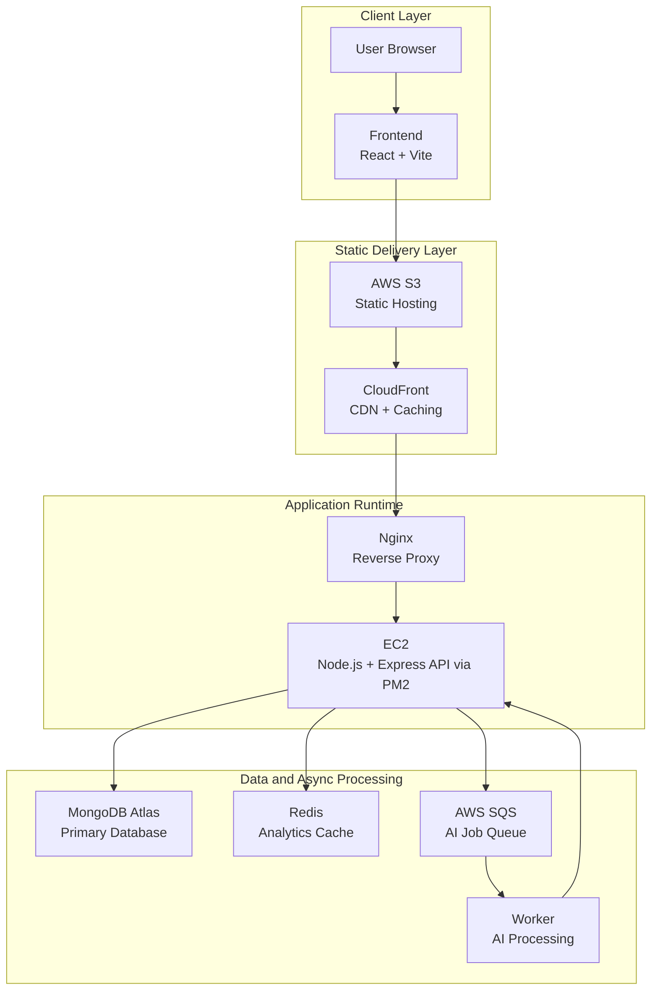
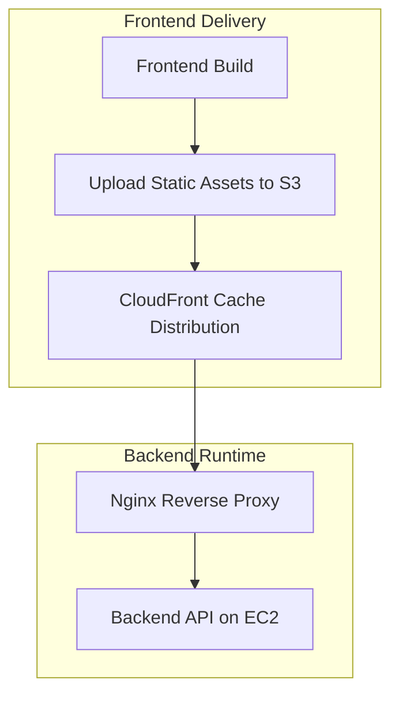
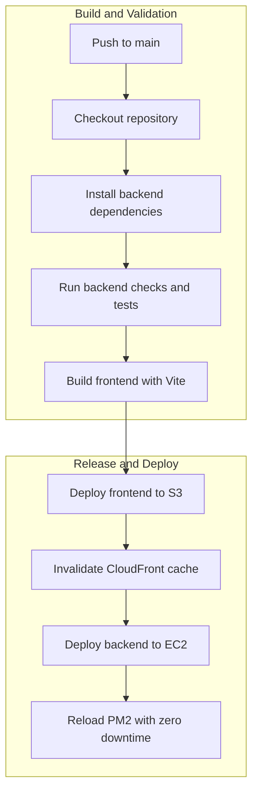
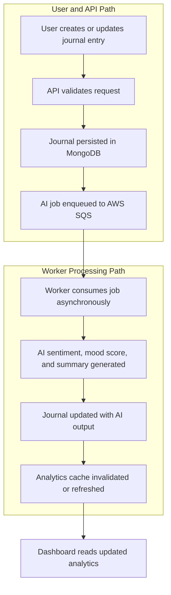

<div align="center">

# Solace

Production-grade AI journaling platform with asynchronous AI processing, cloud deployment on AWS, Redis-backed analytics, and real-time operational visibility.

> Distributed journaling system designed for AI-assisted reflection, worker-based processing, and production-style operations.


### Badges


</div>

## Table of Contents

- [Overview](#overview)
- [Why Solace Exists](#why-solace-exists)
- [Highlights](#highlights)
- [System Characteristics](#system-characteristics)
- [Architecture](#architecture)
- [Deployment Architecture](#deployment-architecture)
- [Engineering Decisions](#engineering-decisions)
- [Engineering Tradeoffs](#engineering-tradeoffs)
- [Journal Processing Flow](#journal-processing-flow)
- [Technology Stack](#technology-stack)
- [DevOps and Infrastructure](#devops-and-infrastructure)
- [Containerization](#containerization)
- [Reliability Considerations](#reliability-considerations)
- [Scalability Notes](#scalability-notes)
- [Observability and Monitoring](#observability-and-monitoring)
- [Security](#security)
- [Performance and Optimization](#performance-and-optimization)
- [Load Testing (k6)](#load-testing-k6)
- [CI/CD Deployment Pipeline](#cicd-deployment-pipeline)
- [Live Demo](#live-demo)
- [Screenshots](#screenshots)
- [Installation](#installation)
- [Configuration](#configuration)
- [Running the Application](#running-the-application)
- [Project Structure](#project-structure)
- [API Endpoints](#api-endpoints)
- [Future Improvements](#future-improvements)
- [Key Learnings](#key-learnings)
- [License](#license)
- [Author](#author)

## Overview

Solace is a full-stack journaling system designed for AI-assisted reflection, structured analysis, and operational reliability. Users can create and manage journal entries while the platform generates sentiment analysis, mood scoring, and summary insights asynchronously.

The system is intentionally built like a production service rather than a demo app:

- Asynchronous AI processing through AWS SQS and a dedicated worker
- Redis-backed analytics and repeated-read caching
- Cloud deployment using EC2, S3, CloudFront, and Nginx
- Process management and zero-downtime reloads with PM2
- Monitoring through AWS CloudWatch and application logs

## Why Solace Exists

Most journaling products focus on note capture. Solace was built to go one level deeper: capture the entry, process it asynchronously, and surface structured insight without blocking the user experience.

The design goal was to model a real distributed application with clear separation between user-facing write paths, background AI work, cached analytics reads, and operational controls. That makes the project useful both as a product and as an engineering case study.

## Highlights

- AI-driven sentiment analysis, mood score generation, and summary creation for each journal entry
- Automatic AI re-analysis when journal content is updated
- Analytics dashboard for mood trends, sentiment distribution, and tag insights
- Search across journal title, content, and tags
- Queue-based asynchronous processing using AWS SQS
- Redis cache support for faster analytics and repeated reads
- Hardened backend middleware stack with Helmet and Morgan
- Load-tested API with `103,760` HTTP requests and `0.00%` error rate
- Sustained `p95` latency of `63.78ms` under the recorded test scenario

## System Characteristics

- Distributed request flow with an asynchronous worker boundary for AI processing.
- Read-heavy analytics path optimized with Redis caching.
- Separation of concerns between public-facing API traffic, background processing, and dashboard reads.
- Cloud-fronted frontend delivery with backend traffic routed through Nginx to EC2.
- Operational controls that support logging, monitoring, and zero-downtime reloads.

## Architecture

### Main System Architecture



### Deployment Flow



### Optional CI/CD Pipeline



### System Topology

```text
Frontend (React + Vite)
        |
        v
AWS S3 (Static Hosting)
        |
        v
CloudFront (CDN + Caching)
        |
        v
Nginx (Reverse Proxy)
        |
        v
EC2 (Node.js + Express API via PM2)
        |
        +--------------------+---------------------+
        |                    |                     |
        v                    v                     v
 MongoDB Atlas            Redis                AWS SQS
 (Database)             (Cache)                (Queue)
                                               |
                                               v
                                      Worker (AI Processing)
```

## Deployment Architecture

Solace follows a simple but production-oriented deployment path:

1. Static frontend assets are built and published to S3.
2. CloudFront serves the frontend globally and reduces origin pressure.
3. Nginx terminates and routes inbound traffic to the EC2-hosted API.
4. The Node.js backend runs under PM2 for process supervision and reload control.
5. Journal writes enqueue AI work to SQS, and the worker updates the entry after processing.

This layout keeps the user-facing surface fast while isolating background work and operational concerns.

## Engineering Decisions

- Background AI work is decoupled from the request path so journal writes stay responsive even when model execution or queue processing is delayed.
- AWS SQS is used to absorb AI jobs asynchronously, which avoids coupling user write latency to worker execution time.
- Redis is used for analytics and repeated reads because dashboard data is read frequently and recomputation would add unnecessary load.
- CloudFront sits in front of the static frontend to lower latency, improve cache hit rates, and decouple frontend delivery from backend maintenance windows.
- Nginx acts as the edge reverse proxy for request routing, origin shielding, and deployment flexibility.
- PM2 is used to keep the Node.js process managed and to support zero-downtime reloads on EC2.
- The architecture separates primary persistence, cached analytics, and AI processing so each concern can be tuned independently.

## Engineering Tradeoffs

- Asynchronous processing improves responsiveness, but it introduces eventual consistency between the user action and the AI-enriched journal state.
- Redis reduces repeated analytics cost, but cached data must be invalidated carefully after create, update, and delete operations.
- CloudFront improves frontend delivery and reduces backend pressure, but it adds another layer to reason about during cache refresh and rollout coordination.
- Nginx and PM2 keep the deployment lean and understandable, but they require disciplined process management instead of full orchestration abstractions.
- The architecture prioritizes operational clarity, maintainability, and deployment simplicity over unnecessary orchestration complexity.

## Journal Processing Flow



## Technology Stack

### Backend

- Node.js
- Express.js
- MongoDB Atlas + Mongoose
- Redis
- AWS SQS
- JWT authentication
- Zod validation
- bcrypt
- Morgan
- Helmet
- PM2
- Docker
- GitHub Actions

### Frontend

- React with TypeScript
- Vite
- Axios
- React Router

### Cloud and Infrastructure

- AWS EC2 for backend hosting
- AWS S3 for frontend static hosting
- AWS CloudFront for global CDN and caching
- AWS CloudWatch for logs and monitoring
- AWS IAM for access control and least-privilege roles
- Nginx as the reverse proxy

### Testing and Quality

- k6 for load testing

## DevOps and Infrastructure

- Frontend hosted on S3 and delivered through CloudFront
- Backend hosted on EC2 behind an Nginx reverse proxy
- PM2 manages Node processes and supports zero-downtime reloads
- IAM policies and roles enforce secure service permissions
- Redis cloud cache improves latency and reduces repeated database load

## Containerization

Docker is used as a reproducible build and runtime layer during GitHub Actions execution rather than as a permanent production registry artifact.

- The backend can be built and executed in a containerized CI workflow to keep environment differences from affecting deployment validation.
- The image is treated as an ephemeral CI artifact and is not published to a long-lived container registry.
- Deployment consistency comes from using the same workflow path for build validation and release automation.
- The container layer improves isolation during workflow execution, while the production runtime still relies on EC2, Nginx, and PM2.
- This keeps the deployment model simple while still benefiting from repeatable builds.

## Reliability Considerations

- AI processing is asynchronous, which prevents slow inference or external service delays from blocking API requests.
- Redis-cached analytics reduce repeated work on dashboard reads.
- PM2 keeps the API process supervised and recoverable.
- CloudWatch and PM2 logs provide separate layers of operational visibility.
- Cache invalidation is important after journal updates so analytics remain consistent with the latest AI output.
- The architecture tolerates temporary slowness in the worker path without degrading the core journal write experience.

## Scalability Notes

- SQS creates a natural buffer between user traffic and AI processing throughput.
- Redis reduces pressure on analytics endpoints that would otherwise recompute on every request.
- CloudFront offloads static asset delivery from the backend.
- Nginx and EC2 keep the deployment topology simple enough to scale or replicate later without redesigning the entire stack.
- The current load-test profile shows headroom at average latency, with tail latency being the primary area to watch.

## Observability and Monitoring

- AWS CloudWatch for instance and application monitoring
- PM2 logs for process-level debugging and runtime diagnostics
- CloudFront cache behavior tracking for Hit/Miss visibility
- Morgan request logging for API traffic analysis

## Security

- Helmet secures HTTP headers
- JWT authentication for session security
- bcrypt password hashing
- Input validation using Zod
- IAM role-based access control for AWS resources

## Performance and Optimization

- Asynchronous processing with AWS SQS reduces API blocking
- Redis cache lowers repeated computation and read latency
- CloudFront CDN improves frontend delivery speed globally
- PM2 zero-downtime reloads minimize service interruption

## Load Testing (k6)

Load test executed with script [load-tests/test-journals.js](load-tests/test-journals.js).

### Performance Snapshot

| Metric | Value |
| --- | ---: |
| Latency (p95) | `63.78ms` |
| Latency (avg) | `29.32ms` |
| Throughput (HTTP) | `345.86 req/s` |
| Throughput (iterations) | `172.93 iter/s` |
| Error rate | `0.00%` |

### Scenario

- 1 scenario
- Up to 20 VUs
- 5m duration over 4 stages with graceful ramp down and stop

### Thresholds

- `http_req_duration`: `p(95)=63.78ms` with threshold `p(95)<150` passed
- `http_req_failed`: `0.00%` with threshold `rate<0.01` passed

### Total Results

- Checks total: `207,520`
- Checks succeeded: `100.00%` (`207,520/207,520`)
- Checks failed: `0.00%` (`0/207,520`)
- HTTP requests: `103,760`
- Iterations: `51,880`
- VUs max: `20`

### HTTP Metrics

- `http_req_duration`: avg `29.32ms`, med `20.51ms`, p(90) `49.93ms`, p(95) `63.78ms`, max `1.61s`
- `http_req_failed`: `0.00%` (`0/103,760`)

### Execution Metrics

- `iteration_duration`: avg `59.53ms`, med `45.28ms`, p(90) `94.68ms`, p(95) `114.84ms`, max `2.5s`

### Network Metrics

- Data received: `83 MB`
- Data sent: `9.4 MB`

### Bottleneck Analysis

- Primary bottleneck was tail latency under peak load, not average latency.
- Evidence: request max latency reached `1.61s` while p95 remained `63.78ms`, which points to intermittent slow paths rather than sustained saturation.
- The most likely pressure points are AI job enqueue and processing boundaries, database write contention, and occasional cache misses.
- Practical next step: instrument endpoint-level timing for the API route, DB query, SQS enqueue, and Redis hit/miss path in CloudWatch to isolate which stage drives the long-tail spikes.

## CI/CD Deployment Pipeline

Implemented GitHub Actions deployment flow for the `main` branch:

1. Checkout repository
2. Install backend dependencies
3. Run backend checks and tests if configured
4. Build frontend with Vite
5. Deploy frontend to S3
6. Invalidate CloudFront cache
7. Deploy backend to EC2 over SSH
8. Reload PM2 process with zero downtime

## Live Demo

- Live Website: [https://ai-journal-dun.vercel.app/](https://ai-journal-dun.vercel.app/)
- Demo Video: [https://youtu.be/TUG6KXk9c4Y](https://youtu.be/TUG6KXk9c4Y?si=47uG7v9hzXgBEoH7)

[](https://youtu.be/TUG6KXk9c4Y?si=47uG7v9hzXgBEoH7)

## Screenshots

### Dashboard Screenshot

> Placeholder: add a dashboard screenshot here to show the analytics surface and primary navigation.

### Analytics Screenshot

> Placeholder: add an analytics screenshot here to show mood trends, sentiment distribution, or tag insights.

### Journal Editor Screenshot

> Placeholder: add a journal editor screenshot here to show the writing experience and entry workflow.

### Observability Screenshot

> Placeholder: add a CloudWatch or PM2 observability screenshot here to show runtime visibility.

### Suggested Screenshot Locations

- Place the hero screenshot directly under the badges section if you want an immediate product impression.
- Add a dashboard screenshot before the architecture section to show the analytics surface area.
- Add a journal detail or AI insight screenshot near the journal processing flow to connect the UI to the system design.
- Add a deployment or observability screenshot near the DevOps and Infrastructure section if you want to emphasize operational maturity.

## Installation

```bash
git clone <repository-url>
cd AI_JOURNAL
```

### Backend Setup

```bash
cd backend
npm install
```

### Frontend Setup

```bash
cd ../frontend
npm install
```

## Configuration

Create a `.env` file in `backend/`:

```env
PORT=5000
NODE_ENV=development
CORS_ORIGIN=http://localhost:5173

MONGODB_URI=your_mongodb_uri
REDIS_URL=your_redis_url

ACCESS_TOKEN_SECRET=your_access_token_secret
ACCESS_TOKEN_EXPIRY=1d
REFRESH_TOKEN_SECRET=your_refresh_token_secret
REFRESH_TOKEN_EXPIRY=7d

HUGGINGFACE_API_KEY=your_huggingface_api_key
GROQ_API_KEY=your_groq_api_key

AWS_REGION=your_aws_region
SQS_QUEUE_URL=your_sqs_queue_url
```

Create a `.env` file in `frontend/`:

```env
VITE_API_BASE_URL=http://localhost:5000/api/v1
```

## Running the Application

### Development

Backend:

```bash
cd backend
npm run dev
```

Frontend:

```bash
cd frontend
npm run dev
```

### Production (Typical)

- Frontend built and uploaded to S3, served through CloudFront
- Backend process started or reloaded via PM2 on EC2 behind Nginx

## Project Structure

```text
AI_JOURNAL/
|-- .github/
|   `-- workflows/
|       `-- deploy.yml
|-- backend/
|   |-- ecosystem.config.js
|   |-- src/
|   |   |-- app.js
|   |   |-- controllers/
|   |   |-- models/
|   |   |-- routers/
|   |   |-- services/
|   |   |-- workers/
|   |   `-- utils/
|   `-- public/
|-- frontend/
|   |-- src/
|   |   |-- api/
|   |   |-- components/
|   |   |-- context/
|   |   |-- hooks/
|   |   |-- pages/
|   |   |-- routes/
|   |   `-- types/
|   `-- public/
|-- load-tests/
|   `-- test-journals.js
|-- README.md
`-- package.json
```

## API Endpoints

### Auth

- `POST /api/v1/users/register`
- `POST /api/v1/users/login`
- `POST /api/v1/users/logout`
- `POST /api/v1/users/refresh-token`

### Journals

- `POST /api/v1/journals`
- `GET /api/v1/journals`
- `GET /api/v1/journals/:id`
- `PUT /api/v1/journals/:id`
- `DELETE /api/v1/journals/:id`

### Analytics

- `GET /api/v1/analytics/mood-trends`
- `GET /api/v1/analytics/sentiment-distribution`
- `GET /api/v1/analytics/tags-distribution`
- `GET /api/v1/analytics/average-mood-by-tag`

## Future Improvements

- Add more granular endpoint tracing to measure request, queue, worker, and cache latency separately.
- Expand automated testing coverage beyond load testing if more unit or integration checks are introduced.
- Add richer analytics visualizations where they improve decision-making without increasing dashboard noise.
- Strengthen deployment telemetry by correlating API logs, worker logs, and cache invalidation events.
- Continue refining cache invalidation paths as analytics or processing behavior evolves.

## Key Learnings

- Asynchronous processing is the cleanest way to keep AI-assisted write flows responsive.
- Analytics caches need explicit invalidation when upstream content changes.
- Tail latency matters as much as average latency when evaluating production readiness.
- A simple deployment topology is easier to operate, instrument, and explain in interviews.
- Engineering tradeoffs become clearer when the README documents the system as a distributed workflow instead of only a feature list.

## License

ISC License

## Author

Lipika Mandal
